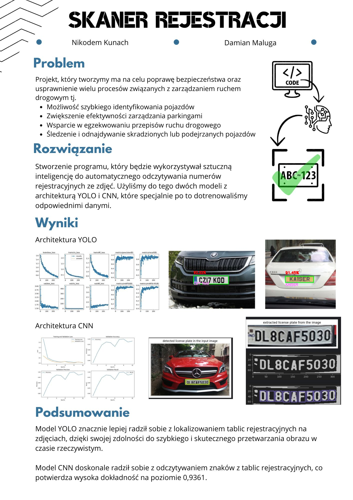
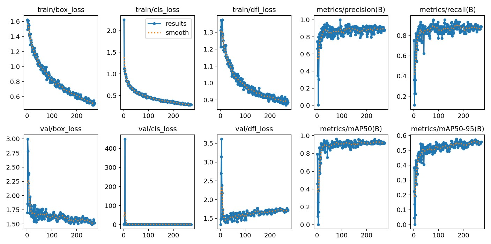
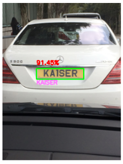
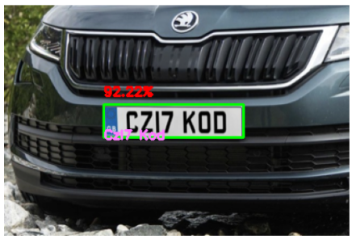
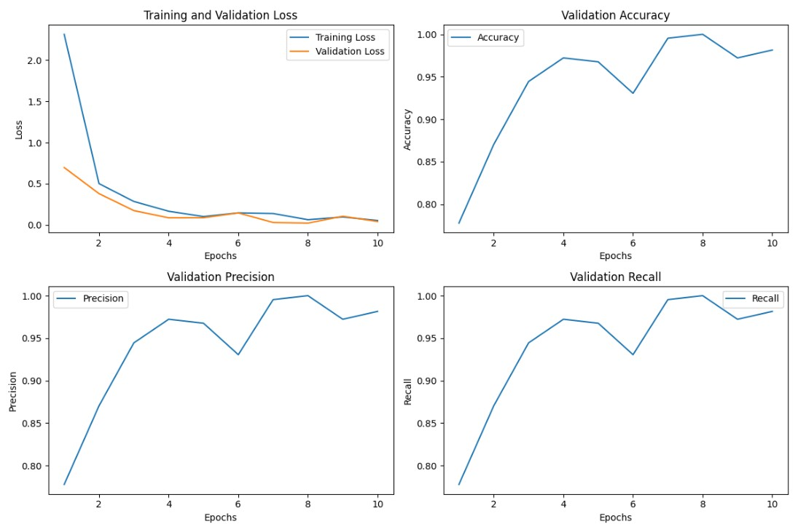
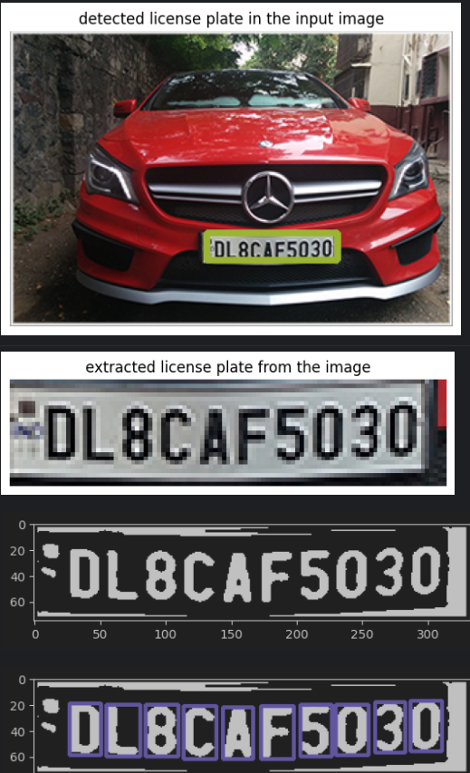

# License Plate Detector



This project focuses on detecting and recognizing license plates using two approaches: YOLO (You Only Look Once) for object detection and a custom Convolutional Neural Network (CNN) for character recognition. The project uses the `Poetry` tool for dependency management and pre-commit hooks for maintaining code quality.

## Table of Contents
1. [Dataset](#dataset)
2. [YOLO Model](#yolo-model)
    - [Training Script](#training-script)
    - [Detection Script](#detection-script)
    - [Evaluation Metrics](#evaluation-metrics)
3. [CNN Model](#cnn-model)
    - [Training Script](#training-script-1)
    - [Detection Script](#detection-script-1)
    - [Evaluation Metrics](#evaluation-metrics-1)
4. [Tools and Environment](#tools-and-environment)
5. [Usage](#usage)
6. [Installation](#installation)

## Dataset

The dataset consists of images of cars with license plates and annotated bounding boxes around the plates. The dataset is divided into training, validation, and test sets.

- **YOLO Model:**
  - **Images**: 432 car images in PNG format
  - **Annotations**: 432 XML files
  - **Source**: Kaggle dataset

- **CNN Model:**
  - **Images**: Digit and letter images (0-9, A-Z)
  - **Source**: Kaggle dataset
  - **Test Set**: Contains multiple folders, each named after a specific character (letter or digit), with 29 PNG files per folder.
  - **Validation Set**: Contains multiple folders, each named after a specific character (letter or digit), with 6 PNG files per folder.

### Dataset Split

#### YOLO Model
The YOLO model dataset is split into:
- 80% training
- 10% validation
- 10% test

#### CNN Model
The CNN model dataset is structured as follows:
- **Validation Set**: Contains multiple folders, each named after a specific character (letter or digit), with 6 PNG files per folder.
- **Training Set**: Contains multiple folders, each named after a specific character (letter or digit), with 29 PNG files per folder.

### Preprocessing and Augmentation
- Scaling are applied to increase the dataset variability.

## YOLO Model

The YOLO model is used for detecting license plates in images.

### Training Script

The YOLO model training script is located in `yolo_train.py`. This script performs the following tasks:

1. Loads and preprocesses the dataset.
2. Splits the dataset into training, validation, and test sets.
3. Converts the data to YOLO format.
4. Trains the YOLO model on the dataset.
5. Saves the trained model.

### Detection Script

The YOLO model detection script is located in `yolo_detect.py`. This script uses the trained YOLO model to detect license plates in images and extract text using Tesseract OCR.

### Evaluation Metrics

#### YOLO Model Results

- **Precision**: ~0.85
- **Recall**: ~0.78
- **mAP50**: ~0.81
- **mAP50-95**: ~0.75

#### YOLO Model Training Progress


#### YOLO Model Visualization



## CNN Model

The CNN model is used for recognizing characters in license plates.

### Training Script

The CNN model training script is located in `main.py`. This script performs the following tasks:

1. Detects license plates in images using a pre-trained Haar Cascade classifier.
2. Segments the characters in the detected license plates.
3. Trains a CNN model on the segmented characters.
4. Saves the trained model.

### Detection Script

The CNN model detection script is located in `run.ipynb`. This Jupyter notebook uses the trained CNN model to recognize characters in license plates detected in images.

### Evaluation Metrics

#### CNN Model Results

- **Average Loss**: 0.362
- **Average Validation Loss**: 0.175
- **Average Accuracy**: 93.61%
- **Average Precision**: 93.61%
- **Average Recall**: 93.61%
- **Average F1 Score**: 93.61%

#### CNN Model Training Progress


#### CNN Model Visualization


### Tools and Environment

- **Libraries**: OpenCV, Pytorch, Tesseract, matplotlib, pandas, numpy, scikit-learn
- **Environment**: The project is designed to run on both CPU and GPU. The specific hardware requirements depend on the size of the dataset and the complexity of the neural network models used. GPUs are recommended for faster training, especially for the YOLO model which has been pre-trained for 300 epochs.

## Usage

To use the models, run the training scripts to train the models on the provided datasets. Then, use the detection scripts to detect and recognize license plates in images.

## Installation

1. **Clone the repository**:
    ```sh
    git clone <repository-url>
    cd <repository-name>
    ```

2. **Install dependencies using Poetry**:
   
    Poetry is a tool for dependency management and virtual environment handling in Python. Make sure you have Poetry installed. If not, install it according to [the official Poetry documentation](https://python-poetry.org/docs/).

    After installing Poetry, navigate to the project directory and add all required dependencies using the poetry install command.

    ```sh
    poetry install
    ```

3. **Set up pre-commit hooks**:
    ```sh
    pip install pre-commit
    ```

4. **Run the training scripts**:
    ```sh
    poetry run python carPlateDetector/yolo/yolo_train.py
    poetry run python carPlateDetector/cnn/main.py
    ```

5. **Run the detection scripts**:
    ```sh
    poetry run python carPlateDetector/yolo/yolo_detect.py
    poetry run python carPlateDetector/cnn/run.py
    ```

6. **View the video demonstration**:

A video demonstration illustrating the functionality of the code in PyCharm down below:)

[](https://www.youtube.com/watch?v=XgktLbXLYvM&ab_channel=NikodemKunach)

